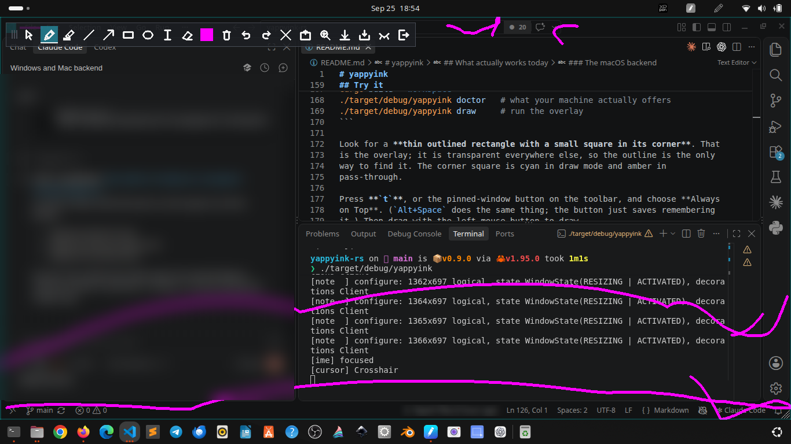
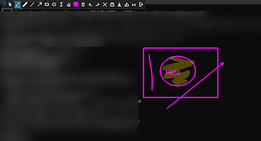
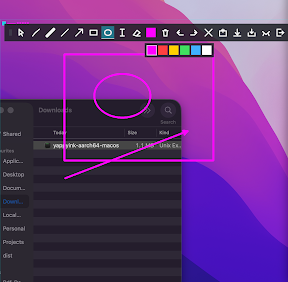

# yappyink

[](https://github.com/algorisys-oss/yappyink-rs/actions/workflows/ci.yml)

Draw on top of your screen while the applications underneath keep working.

You circle a function in your editor, draw an arrow, and then keep scrolling and
typing in that editor while your annotations stay on the screen. The ink belongs
to the screen, not to the document underneath, so it does not scroll with the
page.

**Status: early (0.9).** Three backends. Drawing, pass-through and the global
shortcuts have been seen working on one Ubuntu machine, one Windows machine and
one Mac; much else has not, and the tables below say which. Versions are
explained in [docs/ship-it.md](docs/ship-it.md); the leading zero is about the
platform matrix, not about polish.

Formerly specified under the name *ScreenInk*, which still appears throughout
the specification documents. Same project.

## Screenshots

**Ubuntu (GNOME)**: the toolbar at the top, ink drawn across an editor and a
terminal, with the GNOME extension making the overlay cover the whole monitor.



| Windows | macOS |
|---|---|
|  |  |
| Shapes, a highlighter stroke and text over a terminal. | Shapes over Finder, with the colour swatches open. |

Personal details in the Windows and Ubuntu shots are blurred, and the macOS
shot is cropped for the same reason.

## Quick start

Download from the [latest release](https://github.com/algorisys-oss/yappyink-rs/releases/latest).
With no command, or on a double-click, it opens the overlay and toolbar.

| | Ubuntu / GNOME | Windows | macOS (Apple Silicon) |
|---|---|---|---|
| Download | `yappyink-x86_64-linux` | `yappyink-x86_64-windows.exe` | `yappyink-aarch64-macos` |
| Needs | Ubuntu 22.04 or newer (built for it; seen on 24.04), GNOME on Wayland (the default) | 64-bit Windows (seen on one Windows machine; versions not yet recorded) | an Apple Silicon Mac (seen on one; version not yet recorded) |
| Start | `chmod +x`, then run or double-click | double-click; SmartScreen warns once (unsigned) | `chmod +x`; right-click, **Open** the first time (unsigned) |
| Window | floating, 1280×720 or 80% of a small screen; drag the corner to enlarge. **With the GNOME extension: the whole monitor** | the whole primary monitor; `yappyink draw --monitor 2` for another | 1280×720 on the main screen |
| Stays above other windows | press `t` (or the pin button) and choose *Always on Top*, once per launch. **With the extension: automatic** | automatic | automatic |
| Back from pass-through, from anywhere | `yappyink toggle-draw`, bound to a key in GNOME's keyboard settings | **Ctrl+Alt+D** | **Control+Option+D** |
| Hide or show the ink, from anywhere | `yappyink hide`, bound to a key | **Ctrl+Alt+H** | **Control+Option+H** |
| Live zoom | `z` steps 2×, 3×, 4×; `0` resets (GNOME's magnifier) | `z` or **Ctrl+Alt+Z** steps 2×, 3×, 4×; `0` or **Ctrl+Alt+0** resets (Windows' Magnification API), seen working ([E018](docs/evidence/E018-windows-live-zoom.md)) | not yet: macOS has no public API for its Zoom, so the route is still to be decided (T039) |
| Seen working | drawing, pass-through, zoom, the extension | drawing, pass-through, both chords, fullscreen apps, zoom | drawing, pass-through, both chords, fullscreen apps |

**The GNOME extension** is attached to every release as
`yappyink-gnome-extension.zip`. It keeps the overlay above other windows, on
every workspace, and across the whole monitor, and stays transparent
([E007](docs/evidence/E007-gnome-shell-extension.md)). Verified on GNOME Shell
46, which Ubuntu 24.04 ships:

```sh
gnome-extensions install yappyink-gnome-extension.zip
# log out and back in, then:
gnome-extensions enable yappyink@algorisys-oss.github.io
```

## The toolbar


The dotted handle at the left end moves the overlay, and the small triangle in
its bottom-right corner resizes it. Hovering a button shows its name and key.
Keys work while the overlay has keyboard focus; when it does not, use the
global shortcuts above.

| Button | Name | Key | What it does | Differences by OS |
|---|---|---|---|---|
|  | Select | `s` or `8` | Click an object to select it; drag to move, drag a corner handle to resize, `Del` to delete | |
|  | Pen | `1` | Freehand ink | |
|  | Highlighter | `2` | Wide translucent ink; overlapping parts of one stroke do not darken | |
|  | Line | `3` | Straight line | |
|  | Arrow | `4` | Line with a head where the drag ends | |
|  | Rectangle | `5` | Drag from corner to corner | |
|  | Ellipse | `6` | Drag out its bounding box | |
|  | Text | `9` | Click to place a caret and type; `Enter` for a new line, `Esc` discards | Input-method composition on Ubuntu and Windows; Latin only on macOS |
|  | Eraser | `e` or `7` | Removes whole objects its sweep touches, as one undoable step | |
|  | Colour | `c` cycles | Opens the row of colour swatches; the button shows the current colour | |
|  | Delete selected | `Del` | Deletes what the select tool picked | |
|  | Undo | `u` | Undo the last change | |
|  | Redo | `r` | Redo it | |
|  | Clear all | `x` | Removes everything; undo brings it back | |
|  | Always on top | `t` | Opens GNOME's window menu, where *Always on Top* is | **Ubuntu only.** Not needed with the extension. On Windows and macOS the overlay is already on top and the button says so |
|  | Zoom | `z`, `0` off | Live zoom 2×, 3×, 4×, off, following the pointer; the system does the magnifying, so no screen pixels reach yappyink | **Ubuntu** (GNOME's magnifier; your settings are restored afterwards) and **Windows** (Magnification API, also Ctrl+Alt+Z / Ctrl+Alt+0 from anywhere). Not on macOS yet |
|  | Pass through | `p` | The ink stays; clicks and keys go to the applications underneath | On Ubuntu the toolbar stays clickable. On Windows and macOS the whole overlay lets clicks through, so come back with the shortcut |
|  | Shrink to toolbar | `g` | Hides the ink and shrinks the overlay to just the toolbar; again to come back | On macOS the window does not shrink yet |
|  | Hide | `h` | Hides everything, keeping the ink in memory | The overlay has no keyboard while hidden: use the shortcut or `yappyink toggle-draw` |
|  | Save and quit | | Saves the session, then quits | The `q` key quits **without** saving; `w` saves |

Keys with no button:

| Key | What it does |
|---|---|
| `d` | Back to drawing |
| `w` / `o` | Save the session / open it again |
| `[` / `]` | Thinner / thicker |
| `-` / `=` | Less / more opaque |
| `Esc` | Cancel a stroke in progress, or leave draw mode |
| `q` | Quit without saving |

## What actually works today

| Environment | State |
|---|---|
| Linux, GNOME Wayland (Mutter) | drawing, pass-through, hide and show, control socket, **live zoom** through the GNOME magnifier (`z`, [E017](docs/evidence/E017-gnome-live-zoom.md)) — with the limitations below |
| Linux, wlroots compositors (layer-shell) | not implemented |
| Linux, X11 | not implemented |
| Windows | **drawing, pass-through and the chord work**, seen on one machine: the overlay stays above other windows, every tool draws ([E010](docs/evidence/E010-first-windows-run.md)), in pass-through clicks reach the application underneath, and Ctrl+Alt+D brings it back ([E012](docs/evidence/E012-windows-pass-through.md)). `Ctrl+Alt+H` hides and restores it, and it works over a fullscreen application ([E014](docs/evidence/E014-hide-and-fullscreen.md)). T003 is done. Other monitors and virtual desktops are not yet confirmed |
| macOS | **drawing, pass-through and the chord work**, seen on one Retina Mac: the overlay stays above other apps and the shape tools draw ([E011](docs/evidence/E011-first-macos-drawing.md)), and Control+Option+D brings it back from pass-through ([E013](docs/evidence/E013-macos-global-chord.md)). The first launch, on 0.6.0, appeared to freeze, for reasons since fixed ([E009](docs/evidence/E009-first-macos-launch.md)). In pass-through the apps underneath can be used; hide and fullscreen work too ([E014](docs/evidence/E014-hide-and-fullscreen.md)). T004 is closed with Spaces deferred: switching desktops has not been tested |

`yappyink draw` starts the overlay on all three. CI builds and links the Windows
and macOS binaries on real runners and runs the unit tests there, which keeps
the code honest as far as a compiler can. **It does not mean the overlay works
on either.** A runner has no one watching a screen, and every question that
matters — does a window appear, do clicks land, does pass-through let them
through — is about what a person sees. `yappyink doctor` reports every capability
nobody has seen as `unknown` for that reason.

On GNOME specifically, measured rather than assumed
([evidence](docs/evidence/)):

- The overlay is a **floating window**, not a full-screen layer. Making it
  cover the whole output makes Mutter stop compositing it, and the transparency
  is lost.
- It **cannot choose which monitor** it appears on. xdg-shell gives clients no
  positioning at all.
- It **cannot raise itself** reliably. You apply *Always on Top* once per
  launch, or the ink is covered as soon as you click another window. The app
  has a button for it (see below), but the setting is still the compositor's to
  make, not ours.

None of that is worked around by faking anything. See
[ADR-002](docs/adr/ADR-002-gnome.md) for why GNOME is a limited preview.

The **GNOME Shell extension** in [integrations/gnome/](integrations/gnome/)
lifts the last two limits: with it the overlay stays above other windows, is on
every workspace, and covers the whole monitor, top bar included, and stays
transparent ([E007](docs/evidence/E007-gnome-shell-extension.md)). Verified on
GNOME Shell 46 only. Install it once with `integrations/gnome/install.sh`, then
log out and back in.

### The Windows backend

[crates/ink-platform-windows](crates/ink-platform-windows/) is T003, **done
on native evidence** from the one machine it has been run on. Drawing works
([E010](docs/evidence/E010-first-windows-run.md)): the overlay stays above
other windows, clicks on empty canvas draw, and every tool shown worked.
Pass-through works too, and `Ctrl+Alt+D` brings it back
([E012](docs/evidence/E012-windows-pass-through.md)). It is one layered window, and each style bit buys
one thing the specification asks for:

| Flag | What it gives us |
|---|---|
| `WS_EX_LAYERED` | per-pixel alpha, painted with `UpdateLayeredWindow`. This *is* the overlay |
| `WS_EX_TOPMOST` | stays above other windows, without asking the user for anything |
| `WS_EX_TRANSPARENT` | pass-through: Windows routes the click to whatever is underneath |
| `WS_EX_TOOLWINDOW` | out of the taskbar and Alt-Tab |

What it does: drawing, every tool, the full toolbar (**the same toolbar the
Linux build draws, from the same code** in [crates/ink-ui](crates/ink-ui/)),
text with live preview and input-method composition, undo, save and load,
`Ctrl+Alt+D` and `Ctrl+Alt+H` from anywhere through `RegisterHotKey`, and the
`yappyink toggle-draw` family of verbs, delivered as window messages. It covers
the whole primary monitor, or another one with `yappyink draw --monitor 2`;
Parked shrinks it to the toolbar; the grip moves it and the corner resizes it;
the cursor follows the tool; and a DPI or display change resizes it to fit.

Three things about it are not obvious:

- **Transparent pixels do not take clicks.** Windows lets a click through a
  layered window wherever alpha is zero. So in Draw the frame is covered with an
  alpha-1 floor that nobody can see, or clicks on empty canvas would land in the
  application underneath. [AGENTS.md](AGENTS.md) warns against equating
  transparent pixels with input capture; this is the same mistake from the
  other side.
- **The toolbar cannot be clicked in pass-through.** `WS_EX_TRANSPARENT` applies
  to the whole window, and there is no way to make one part of it solid. Wayland
  narrows an input region instead. `Ctrl+Alt+D` is the way back.
- **It takes focus in Draw.** `WS_EX_NOACTIVATE` would stop that, but a window
  that never activates gets no keyboard at all, and the text tool needs one. In
  pass-through the application underneath keeps focus, which is the case that
  matters.

Most of the crate is testable here: `keys` and `surface` take no Windows types,
and hold monitor choice, fitting, parking, drag arithmetic, the cursor mapping
and the remote message numbering, with 25 tests in the ordinary suite. Only the
window itself needs Win32. [ADR-005](docs/adr/ADR-005-windows-bindings.md)
explains the binding choice.

**Beyond E010, nothing has been confirmed.** A throwaway probe,
[experiments/windows-layered](experiments/windows-layered/), exists to answer
the basic questions first, and `docs/handoff.md` says how to run it and what to
record.

### The macOS backend

[crates/ink-platform-macos](crates/ink-platform-macos/) is T004, **in
progress, and drawing works on the one Mac it has been run on**
([E011](docs/evidence/E011-first-macos-drawing.md)). Its first launch, on
0.6.0, appeared to freeze ([E009](docs/evidence/E009-first-macos-launch.md)). A borderless `NSWindow` with a clear background at
window level 1000 (`kCGScreenSaverWindowLevel`), holding a custom `NSView`.
Pass-through is `setIgnoresMouseEvents:`, which is AppKit's own hit-test
routing, so nothing is forwarded. It draws with the same toolbar and the same
tools, and **Control+Option+D** and **Control+Option+H** work from anywhere,
through Carbon's `RegisterEventHotKey`, which needs no permission
([ADR-007](docs/adr/ADR-007-macos-global-shortcut.md)). Control+Option+D has
been seen bringing the overlay back from pass-through
([E013](docs/evidence/E013-macos-global-chord.md)). Before that chord
existed, the only way back from pass-through was the terminal.

What it does not do yet: input methods, choosing a screen, shrinking when
Parked, and the CLI verbs. The toolbar is not clickable in pass-through or
Parked, for the same reason as on Windows.

The question most likely to produce a bad answer is what happens over a
**fullscreen** application and across **Spaces**. `NSWindowCollectionBehavior`
is set to join all Spaces and act as a fullscreen auxiliary, which is the
documented way; whether it is honoured at this window level is exactly the
unknown. There is also a focus tension with no free answer: a window that
accepts a key press has to become key, and that takes focus from the
application being annotated.

**This is the least verified code in the repository.** Nobody on this project
has a Mac. CI builds and links it on a macOS runner, and one user's Mac has
shown it drawing; nothing beyond that is confirmed. If nobody ever runs it, the honest outcome is to declare macOS
unsupported rather than ship it quietly, and
[ADR-006](docs/adr/ADR-006-macos-bindings.md) says so.

**If you have a Mac and want to help, this is the single most useful thing you
could do for this project:**

```sh
cargo run -p exp-macos-overlay        # primary screen
cargo run -p exp-macos-overlay -- 1   # the second one
```

It prints its own checklist. `d` switches mode, `q` quits. Then try the real
thing, `yappyink draw`, from the release page. Open an issue with what you saw,
failures included — a clear negative result is worth as much here as a positive
one.

## Try it

Requires Rust 1.95. The instructions below are for Linux, which needs a Wayland
session. On Windows and macOS, download the binary from the release page and
double-click it, or run `yappyink` from a terminal: with no command it opens
the overlay and toolbar. `yappyink help` lists the rest.

```sh
cargo build --workspace
./target/debug/yappyink doctor   # what your machine actually offers
./target/debug/yappyink draw     # run the overlay
```

Look for a **thin outlined rectangle with a small square in its corner**. That
is the overlay; it is transparent everywhere else, so the outline is the only
way to find it. The corner square is cyan in draw mode and amber in
pass-through.

Press **`t`**, or the pinned-window button on the toolbar, and choose **Always
on Top**. (`Alt+Space` does the same thing; the button just saves remembering
it.) Then drag with the left mouse button to draw.

That is the compositor's own menu. Mutter gives an application no way to set
Always on Top for itself, so asking for the menu is as close as a Wayland client
can get. The [GNOME extension](integrations/gnome/) removes the step entirely.

A toolbar sits in the top-left of the overlay: the tools, delete, undo, redo,
clear, and the ways out. Rest the pointer on a button for a tooltip naming it
and its key.

The pointer tells you what a click will do: an I-beam for text, a crosshair for
the drawing tools, an arrow over the toolbar and in pass-through, and move or
resize cursors over the grip and the corner.

With the **text** tool, a caret follows the pointer showing exactly where the
line will sit and how tall it will be. Click to place it and type. `Esc` discards what
you typed, clicking elsewhere keeps it and starts a new one, and picking
another tool keeps it too. Text moves and resizes with the select tool like any
other object.

Input methods are wired up through `zwp_text_input_v3`: while you compose, the
provisional text is drawn underlined until the engine commits it, and the
candidate window follows the caret. If a character is missing from the main
font the renderer falls back to another installed face, so CJK, Devanagari,
Arabic, Hebrew and Thai reach the screen rather than rasterising to nothing.

**Latin is what actually works.** There is no text shaping, so scripts that
reorder or join characters come out as a row of separate base glyphs: readable
in principle, wrong in practice. Devanagari matras land after their consonant
instead of around it, and conjuncts do not form. Arabic letters do not join.
Fixing that means a shaping engine, which is not written yet. None of the
non-Latin path has been watched working by the author either; see
`docs/evidence/` for what that distinction means here.

The colour button shows the colour you are about to draw with; click it for a
row of swatches, and clicking one picks it and closes the row. `c` cycles
through the same palette without opening anything.

**It stays in pass-through**, so you can switch tools, undo and come back to
drawing while working in another application. It works there because the
overlay tells the compositor that only the toolbar's rectangle accepts pointer
input: the buttons really are clickable, and every other pixel really does pass
through to whatever is underneath. Without that the toolbar would be a picture
of buttons, which is worse than no toolbar.

**`g` shrinks the overlay to just the toolbar.** The ink goes away, the document
is kept, and the controls stay put. Worth using when you have finished
annotating for a while: a transparent window covering a whole screen and held
above everything can stop the compositor unredirecting a fullscreen application
underneath, which costs that application performance.

`q` saves and quits.

**Drag the ridged grip** at the left of the toolbar to move the overlay, and
**drag the bottom-right corner** to resize it. Both ask the compositor to run
the drag, which is the only way a Wayland client can move or size its own
window. Resizing is worth knowing about: this backend cannot go fullscreen
without losing transparency, so enlarging the window is how you annotate more
of the screen.

Keys, while the overlay has focus:

| Key | Does |
|---|---|
| `d` | draw |
| `p` | pass through: ink stays, input goes to what is underneath |
| `h` | hide the ink, keeping it in memory |
| `1` / `2` | pen / highlighter |
| `3` – `6` | line / arrow / rectangle / ellipse |
| `7` or `e` | eraser |
| `8` or `s` | select |
| `9` | text |
| `t` | window menu, where *Always on Top* lives |
| `Del` | delete what is selected |
| `u` / `r` | undo / redo |
| `w` / `o` | write / open the session file |
| `x` | clear everything |
| `c` | next colour |
| `[` / `]` | thinner / thicker |
| `-` / `=` | less / more opaque |
| `Esc` | cancel a stroke, or leave draw mode |
| `q` | quit |

The corner of the overlay shows the mode, the colour and width you are about to
draw with, and a pip count for the selected tool, so none of that has to be
remembered.

Shapes are dragged from one corner to the other, and a drag that goes nowhere
creates nothing rather than an invisible object you could never select or
erase. Rectangles and ellipses are outlines, not fills, because an annotation
frames what is underneath rather than hiding it.

With the **select** tool, click an object to pick it up, drag it to move it,
drag a corner handle to resize it, and press Delete to remove it. While you
drag, the object fades where it still is and the preview is drawn at full
strength where it is going, so the two are not mistaken for each other. Each is one
undoable edit, and undo restores the exact geometry rather than an approximate
reverse. Clicking empty space deselects; Escape cancels a drag first, then the
selection, then draw mode.

The eraser removes whole objects its sweep touches, never parts of them, and
one sweep is one undoable action however many objects it took. It tests the
path between pointer samples rather than the samples alone, so a fast flick
does not skip over a stroke it passed straight through. `x` clears everything
and `u` brings it all back.

A highlighter's opacity applies to the completed stroke as a whole: scribbling
back and forth over one spot gives an even wash rather than a dark smear.
Drawing over it a *second* time does build up, because that is you asking for a
denser mark.

### Reaching it when something else has focus

Once pass-through is working, clicking the window underneath takes the keyboard
with it, so the overlay cannot hear you. A running overlay listens on a socket:

```sh
yappyink toggle-draw     # from any terminal, whatever has focus
yappyink pass-through
yappyink hide
yappyink emergency-hide
yappyink save
yappyink load
yappyink quit
```

Bind `yappyink toggle-draw` to a chord in **Settings → Keyboard → Custom
Shortcuts** and it works from anywhere. Wayland gives an ordinary application no
way to register a global shortcut for itself; the GlobalShortcuts portal is the
other route and is not implemented yet.

## Saving

`w` writes your annotations, `o` reads them back. One file, at
`$XDG_DATA_HOME/yappyink/session.json` or `~/.local/share/yappyink/session.json`
— there is no file picker yet, because choosing a path needs the desktop's file
portal.

Both print the full path they used, and it is worth reading. A terminal inside
a snap — VS Code's, for one — sets `XDG_DATA_HOME` to somewhere under
`~/snap/`, so a session saved from there will not be found by a yappyink
launched from anywhere else. The path is honoured deliberately; it is printed
so the surprise happens where you can see it.

The file is plain JSON holding vector objects and styles. **No pixels, ever.**
Live drawing never reads your screen, so saving annotations needs no screen
capture permission and cannot contain what was behind them.

A save writes to a temporary file alongside the target and renames it into
place, so an interrupted save leaves your previous file intact. A load validates
the whole file into objects before replacing anything: a corrupt, oversized or
newer-schema file is refused and what is on screen is untouched. Autosave is
off, and there is no autosave to turn on.

## Not built yet

A file picker, image export, text shaping for non-Latin scripts, and
multiple monitors at once. Selection
picks objects by their bounding box rather than their exact outline, and there
is no multi-select and no rotation.
**Nothing is saved when you quit.**

Undo and redo are bound to plain `u` and `r` rather than the usual Ctrl chords,
because modifier tracking is not wired up yet.

Out of scope for a first release entirely: cloud sync, accounts, AI, OCR, video
recording, and screen capture. Live drawing never reads your screen, and it
never asks for a screenshot permission. Capture and freeze are a
[separate, later feature](docs/adr/ADR-003-document-and-capture.md) with their
own permission contract.

## How this repository is built

Specification first, and evidence before claims. The rules are in
[constitution.md](constitution.md); the short version is that a task is not done
because it compiles, a mock is not evidence about a desktop, and a capability
nobody probed is reported as `unknown` rather than assumed to work.

That is why [docs/evidence/](docs/evidence/) exists. Each file records what was
run on a real machine, what happened, and what was *not* tested. Failures are
kept: [E002](docs/evidence/E002-gnome-xdg-shell-experiment.md) is mostly the
story of a route that did not work, and it is the most useful document here.

[docs/learning.md](docs/learning.md) keeps the mistakes for the same reason —
what broke, why, and what changed as a result.
[docs/handoff.md](docs/handoff.md) is the state of play: what is done, what is
next, and what to know before changing anything.

```
crates/ink-core              objects, geometry, documents — no OS, no GPU
crates/ink-app               modes, transitions, gesture rules — no platform
crates/ink-render            software rasteriser, pixel-tested headlessly
crates/ink-platform          typed capability and error contracts
crates/ink-platform-wayland  the Wayland surface and event loop
crates/ink-platform-windows  the Win32 layered window (draws; E010)
crates/ink-platform-macos    the AppKit window (draws; E011)
crates/ink-ui                the toolbar and chrome every backend draws
apps/yappyink                the binary: doctor, draw, control commands
experiments/                 throwaway probes; delete when their ADR closes
```

The dependency direction is one-way: `ink-core` knows nothing about a window,
`ink-app` knows nothing about Wayland, and the adapter decides nothing about
modes or documents. Everything except the adapter is testable without a display,
which is why most of the test suite runs anywhere.

Specifications: [product-spec.md](product-spec.md) for requirements,
[architecture.md](architecture.md) for the design,
[platform-matrix.md](platform-matrix.md) for what each backend must prove,
[ux-state-machine.md](ux-state-machine.md) for the interaction contract, and
[tasks.md](tasks.md) for what is done and what is not.

## Checks

```sh
cargo test --workspace
cargo clippy --workspace --all-targets -- -D warnings
cargo fmt --all --check
python3 tools/check_specs.py    # specification cross-references only
```

The last one validates requirement, task, and scenario references. It does not
test the application, and it never will.

The Gherkin files under `tests/acceptance/` are **scenario specifications, not
executable tests**. No scenario has passed. Where a scenario is partly covered
by real tests, [traceability.json](traceability.json) says which tests and what
is still missing.

The same checks run in CI on every push: the whole workspace on Linux, and the
portable crates plus the binary on Windows and macOS. A tag beginning with `v`
builds the release binaries and publishes them, and refuses if the tag and the
version in `Cargo.toml` disagree. [docs/ship-it.md](docs/ship-it.md) has the
details and is explicit about what a green tick on three platforms does not
mean.

## Licence

MIT. See [LICENSE](LICENSE).
